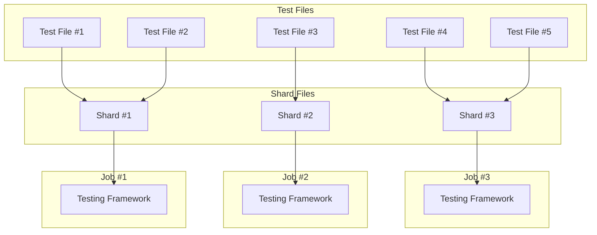
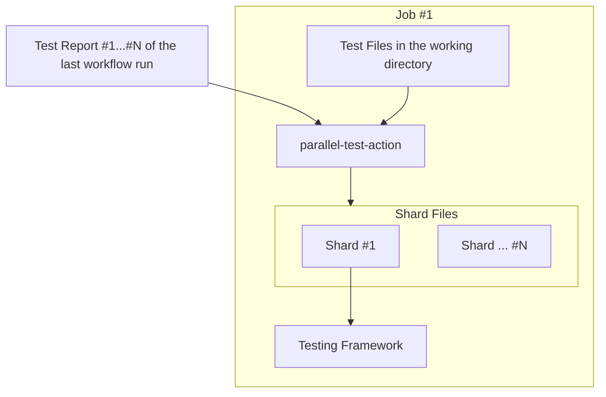
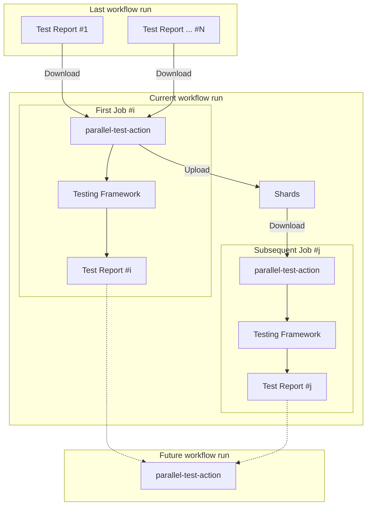

# parallel-test-action [](https://github.com/int128/parallel-test-action/actions/workflows/ts.yaml)

This action distributes the test files to the shards based on the estimated time from the test reports.
You can reduce the time of tests by parallel testing.

## Overview

This action distibutes the test files to the shards based on the estimated time.
Here is the example of the distribution:



Each shard should contain the test files with the similar estimated time.
This action uses the greedy algorithm.

You need to upload the test reports as artifacts on the default branch.
This action estimate the time of each test file using the test reports.
If a test file is not found in the test reports, this action assumes the average time of all test files.
If no test report is given, this action falls back to the round-robin distribution.

## Examples

### Jest

Here is an example workflow to run Jest in parallel.

```yaml
jobs:
  test:
    strategy:
      fail-fast: false
      matrix:
        shard-id: [1, 2, 3]
    runs-on: ubuntu-latest
    steps:
      - uses: actions/checkout@v4
      - uses: int128/parallel-test-action@v1
        id: parallel-test
        with:
          test-files: 'tests/**/*.test.ts'
          test-report-artifact-name-prefix: test-report-
          test-report-branch: main
          shard-count: 3
      - uses: actions/setup-node@v4
      # ...snip...
      - run: xargs pnpm run test -- < "$SHARD_FILE"
        env:
          SHARD_FILE: ${{ steps.parallel-test.outputs.shards-directory }}/${{ matrix.shard-id }}
      - uses: actions/upload-artifact@v4
        with:
          name: test-report-${{ matrix.shard-id }}
          path: junit.xml
```

You can generate a test report using [jest-junit](https://github.com/jest-community/jest-junit).
This action requires `file` attribute of the test report.
See [jest.config.js](jest.config.js) for example.

### RSpec

Here is an example workflow to run RSpec in parallel.

```yaml
jobs:
  test:
    strategy:
      fail-fast: false
      matrix:
        shard-id: [1, 2, 3]
    runs-on: ubuntu-latest
    steps:
      - uses: actions/checkout@v4
      - uses: int128/parallel-test-action@v1
        id: parallel-test
        with:
          test-files: 'spec/**/*_spec.rb'
          test-report-artifact-name-prefix: test-report-
          test-report-branch: main
          shard-count: 3
      - uses: ruby/setup-ruby@v1
      # ...snip...
      - run: xargs bundle exec rspec --format RspecJunitFormatter --out rspec.xml < "$SHARD_FILE"
        env:
          SHARD_FILE: ${{ steps.parallel-test.outputs.shards-directory }}/${{ matrix.shard-id }}
      - uses: actions/upload-artifact@v4
        with:
          name: test-report-${{ matrix.shard-id }}
          path: rspec.xml
```

You can generate a test report using [rspec_junit_formatter](https://github.com/sj26/rspec_junit_formatter).

## How it works

### Action overview

Here is the inputs and outputs of this action:

- Test Files (input)
  - This action finds the test files specified by a glob pattern (e.g. `tests/**/*.test.ts`).
- Test Reports (input)
  - This action finds the last success workflow run of the specified branch, and downloads the test reports.
  - A test report should contain the duration of each test case.
- Shard Files (output)
  - This action generates the shard files based on the estimated time of each test file.
  - A shard file contains the list of test files.
  - Each job should run the tests in the corresponding shard file. For example, job #1 runs the tests in shard #1.

Here is the flow of test job:



### Workflow overview

The test workflow runs the test jobs in parallel.
Each job should process the corresponding shard.

When this action is run in parallel jobs, each job may generate the different shard files.
To avoid the race condition, this action acquires the lock as follows:

1. The first job uploads the shards as an artifact.
   This operation is atomic since GitHub Actions Artifact rejects the same name of artifact.
2. The subsequent jobs download the shards artifact and use it.
   They discard their generated shards.

Here is the structure of test workflow:



## Specification

Here is the typical workflow to run the parallel test jobs.

```yaml
on:
  push:
    branches:
      - main
  pull_request:

jobs:
  test:
    strategy:
      fail-fast: false
      matrix:
        shard-id: [1, 2, 3] # Shard ID starts from #1
    runs-on: ubuntu-latest
    steps:
      # (1) Checkout the repository.
      - uses: actions/checkout@v4

      # (2) Distribute the test files to the shards.
      - uses: int128/parallel-test-action@v1
        id: parallel-test
        with:
          test-files: '**/*' # Glob pattern of your test files
          test-report-artifact-name-prefix: test-report- # Find the test reports of this name
          test-report-branch: main # Find the test reports from the main branch
          shard-count: 3

      # (3) Run your testing framework.
      - run: xargs your-testing-framework < "$SHARD_FILE"
        env:
          SHARD_FILE: ${{ steps.parallel-test.outputs.shards-directory }}/${{ matrix.shard-id }}

      # (4) Upload the test report as an artifact.
      - uses: actions/upload-artifact@v4
        with:
          name: test-report-${{ matrix.shard-id }}
          path: junit.xml
```

Steps:

1. Checkout the repository.
   This action depends on the working directory to generate the list of test files.
2. Distribute the test files to the shards.
   It generates the list of test files for each shard.
3. Run your testing framework.
   It should accept the list of test files to run.
   It should also generate the test report.
4. Upload the test report as an artifact.
   The artifact will be used in the future workflow runs.

### Inputs

| Name                               | Default        | Description                              |
| ---------------------------------- | -------------- | ---------------------------------------- |
| `working-directory`                | `.`            | Working directory                        |
| `test-files`                       | (required)     | Glob pattern of test files               |
| `test-report-artifact-name-prefix` | (required)     | Prefix of the test report artifact name  |
| `test-report-branch`               | (required)     | Branch to find the test report artifacts |
| `shard-count`                      | (required)     | Number of shards                         |
| `shards-artifact-name`             | (\*1)          | Name of the shards artifact              |
| `token`                            | (github.token) | GitHub token                             |

(\*1) The value of `shards-artifact-name` must be same in the parallel jobs.
The default value is `parallel-test-shards--${{ github.job }}`.
For above example, the shards artifact is uploaded as `parallel-test-shards--test`.

### Outputs

| Name               | Description                        |
| ------------------ | ---------------------------------- |
| `shards-directory` | Directory to store the shard files |

This action writes the shard files to the temporary directory.
The shards directory looks like:

```
/home/runner/work/_temp/parallel-test-action-*/shards/1
/home/runner/work/_temp/parallel-test-action-*/shards/2
/home/runner/work/_temp/parallel-test-action-*/shards/3
...
```

The shard ID starts from 1.

Each shard file contains the list of test files.
For example,

```
tests/foo.test.ts
tests/bar.test.ts
tests/baz.test.ts
...
```

Your testing framework should run the test files in the shard file.
You can construct the command by `xargs`, for example:

```sh
xargs your_testing_framework < '${{ steps.parallel-test.outputs.shards-directory }}/${{ matrix.shard-id }}'
```
