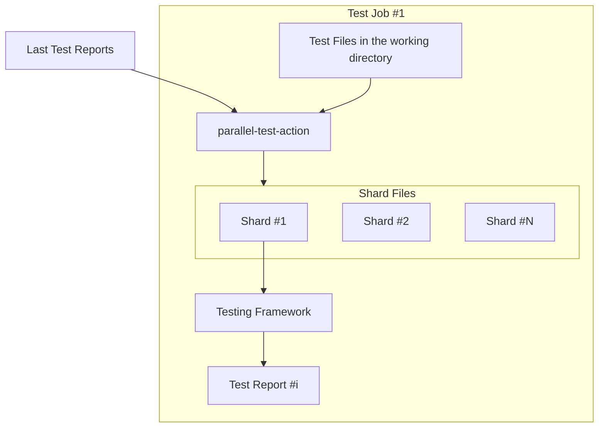
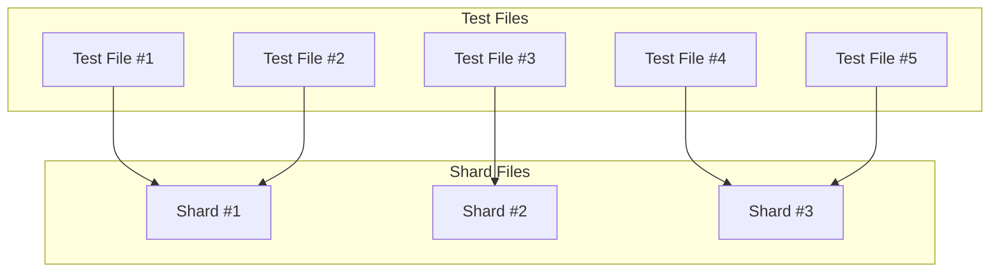

# parallel-test-action [](https://github.com/int128/parallel-test-action/actions/workflows/ts.yaml)

This action distributes the test files to the shards based on the estimated time from the test reports.

## Getting Started

Here are example workflows to run tests in parallel.

### Jest

```yaml
on:
  push:
    branches:
      - main
  pull_request:

jobs:
  test:
    strategy:
      matrix:
        shard-id: [1, 2, 3]
    runs-on: ubuntu-latest
    steps:
      - uses: actions/checkout@v4
      - uses: int128/parallel-test-action@v1
        id: parallel-test
        with:
          test-files: 'tests/**/*.test.ts'
          test-report-artifact-name-prefix: test-report-
          test-report-branch: main
          shard-count: 3
      - uses: actions/setup-node@v4
      # ...snip...
      - run: xargs pnpm run test -- < "$SHARD_FILE"
        env:
          SHARD_FILE: ${{ steps.parallel-test.outputs.shards-directory }}/${{ matrix.shard-id }}
      - if: github.event_name == 'push'
        uses: actions/upload-artifact@v4
        with:
          name: test-report-${{ matrix.shard-id }}
          path: junit.xml
```

### RSpec

```yaml
jobs:
  test:
    strategy:
      matrix:
        shard-id: [1, 2, 3]
    runs-on: ubuntu-latest
    steps:
      - uses: actions/checkout@v4
      - uses: int128/parallel-test-action@v1
        id: parallel-test
        with:
          test-files: 'spec/**/*_spec.rb'
          test-report-artifact-name-prefix: test-report-
          test-report-branch: main
          shard-count: 3
      - uses: ruby/setup-ruby@v1
      # ...snip...
      - run: xargs bundle exec rspec --format RspecJunitFormatter --out rspec.xml < "$SHARD_FILE"
        env:
          SHARD_FILE: ${{ steps.parallel-test.outputs.shards-directory }}/${{ matrix.shard-id }}
      - if: github.event_name == 'push'
        uses: actions/upload-artifact@v4
        with:
          name: test-report-${{ matrix.shard-id }}
          path: rspec.xml
```

## How it works

### Overview

Here is the inputs and outputs of this action:

- Test Files (input)
  - This action finds the test files specified by a glob pattern (e.g. `tests/**/*.test.ts`).
- Last Test Reports (input)
  - This action finds the last success workflow run of the specified branch, and downloads the test reports.
  - A test report should contain the duration of each test case.
- Shard Files (output)
  - This action generates the shard files based on the estimated time of each test file.
  - A shard file contains the list of test files.
  - Each job should run the tests in the corresponding shard file. For example, job #1 runs the tests in shard #1.

Here is the flow of this action:



### Test files distribution

You need to upload the test reports as artifacts on the default branch.
It is required to estimate the time of each test file.

This action distibutes the test files based on the estimated time using the greedy algorithm.
Here is the example of the distribution:



Each shard should contain the test files with the similar estimated time.

If a test file is not found in the test reports, this action assumes the average time of all test files.
If no test report is given, this action falls back to the round-robin distribution.

### Lock for parallel jobs in a workflow

When this action is run in parallel jobs, each job may generate the different shard files.
To avoid the race condition, this action acquires the lock by uploading the shards artifact.

1. The first job acquires the lock by uploading the shards artifact.
2. The other jobs will download the shards artifact and use it. Their generated shards will be discarded.

## Specification

### Inputs

| Name                               | Default                | Description                              |
| ---------------------------------- | ---------------------- | ---------------------------------------- |
| `working-directory`                | `.`                    | Working directory                        |
| `test-files`                       | (required)             | Glob pattern of test files               |
| `test-report-artifact-name-prefix` | (required)             | Prefix of the test report artifact name  |
| `test-report-branch`               | (required)             | Branch to find the test report artifacts |
| `shard-count`                      | (required)             | Number of shards                         |
| `shards-artifact-name`             | `parallel-test-shards` | Name of the shards artifact              |
| `token`                            | (github.token)         | GitHub token                             |

If a single workflow contains the different types of tests,
you need to explicitly set the `shards-artifact-name` to avoid the conflict.

### Outputs

| Name               | Description                        |
| ------------------ | ---------------------------------- |
| `shards-directory` | Directory to store the shard files |

This action writes the shard files to the temporary directory.
The shards directory looks like:

```
/home/runner/work/_temp/parallel-test-action-*/shards/1
/home/runner/work/_temp/parallel-test-action-*/shards/2
/home/runner/work/_temp/parallel-test-action-*/shards/3
...
```

The shard ID starts from 1.

Each shard file contains the list of test files.
For example,

```
tests/foo.test.ts
tests/bar.test.ts
tests/baz.test.ts
...
```

Your testing framework should run the test files in the shard file.
You can construct the command by `xargs`, for example:

```sh
xargs your_testing_framework < '${{ steps.parallel-test.outputs.shards-directory }}/${{ matrix.shard-id }}'
```
